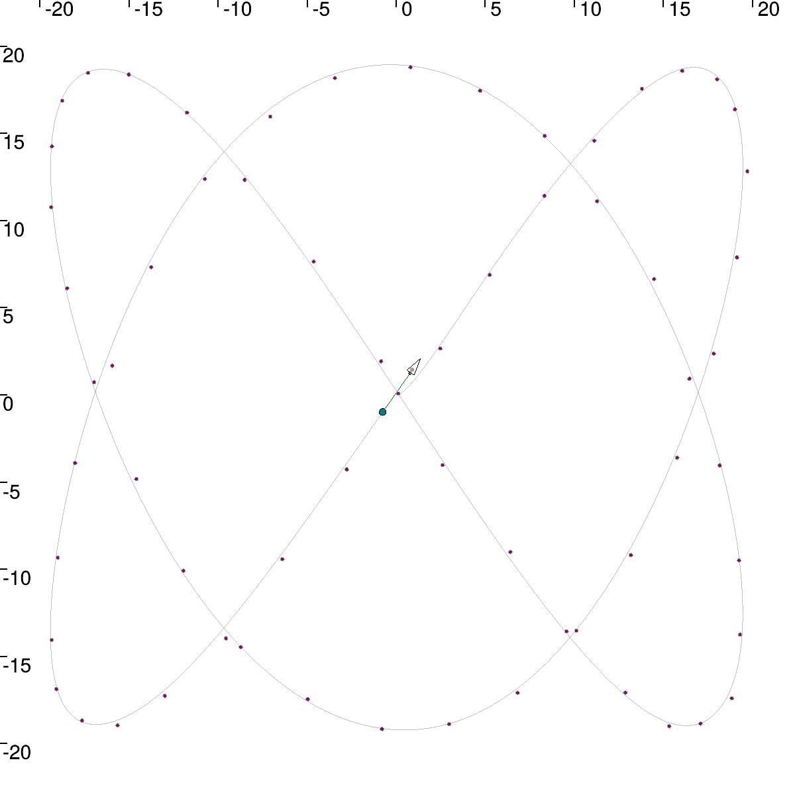

# MagMap

## Introduction

This project is a student project about the mapping of a field using a magnetometer. This magnetometer need to be trailed on a sledge behind the robot in order to have better measurements because the trailing robot generate magnetic perturbations.

## Some already made content

Using feedback linearization, we are able to generate the control vector  to control the speed and the bearing of the robot. This robot is then able to follow any wanted trajectory as the following lissajous curve :

